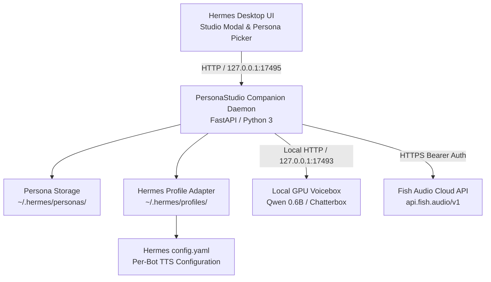

# Hermes Voice Persona Studio 🎙️⚡

[](https://opensource.org/licenses/MIT)
[](https://www.python.org/downloads/)
[](https://fastapi.tiangolo.com)
[](https://nousresearch.com)
[](https://developer.nvidia.com/cuda-zone)

**Speaking persona = display name + LLM system prompt + bound TTS voice.** Users switch that bundle from the Hermes Desktop titlebar and create it in Studio. Cloning a voice registers TTS *and* writes a matching persona bundle under `~/.hermes/personas/` — a Voicebox/Fish clone by itself is not enough.

The plugin stays outside `~/.hermes/hermes-agent` so Nous Hermes updates remain a clean checkout.

Powered seamlessly by **Fish Audio Cloud** and **Local GPU Neural TTS (Voicebox)**.

---

## 🌟 Key Features

### ⚡ Dual-Engine Synthesis (Cloud & Local GPU)
* **Cloud: Fish Audio**: High-fidelity hosted neural synthesis with custom zero-shot voice cloning, automated private model discovery (`self=true`), and cloud model management.
* **Local GPU: Neural Voicebox**: Zero-cloud, 100% private, offline TTS running on local NVIDIA GPUs. Features pre-configured models including **Qwen 3 (0.6B Fast)** delivering **~0.4s instant latency**, Chatterbox Turbo, and Kokoro.

### 🎙️ Zero-Shot Voice Cloning from UI
* Drag-and-drop or upload any 10–30 second reference sample (`.wav`, `.mp3`, `.m4a`).
* Register the cloned voice on local GPU Voicebox or Fish Audio **and** auto-create/update a speaking persona bundle (`prompt.md` + bound `voice_id`).
* Existing clones can be reconciled later with `python3 install.py --sync-voices` (idempotent).

### ⚙️ Provider Voice Model Management
* **Filter & Search**: Quickly search and clean up duplicate voice clones across providers.
* **Re-sample on Demand**: Refresh an existing voice profile with newer, clearer studio audio without breaking downstream bot associations.
* **1-Click Deletion**: Safely prune outdated or duplicate clones from both local storage and cloud APIs.

### 🤖 1-Click Bot & Profile Voice Assignment
* Directly assign any cloned voice to your Hermes bots (`PC Maintainence / mechanic`, `Research Agent / magellan`, `critic`, `default`) with a single click.
* **Hermes Group Chat Ready**: When participating in multi-bot group chats (like `Promax Group`), each bot automatically responds with its distinct cloned voice when addressed via `@mention` or round-robin debate.

### 🛡️ 100% Non-Destructive
* Zero edits to the upstream Hermes agent repository (`~/.hermes/hermes-agent` stays a clean git checkout).
* Portable persona bundles saved safely in `~/.hermes/personas/` with isolated manifest and prompt markdown files.
* Built-in Electron single-instance lock recovery for Linux / Pop!_OS COSMIC environments.

---

## 🏗️ Architecture



---

## 🚀 Quick Installation

### Prerequisites
* **Hermes Desktop** installed on Linux, macOS, or Windows.
* Python 3.10+ with `pip`.
* Optional: Local NVIDIA GPU with CUDA for local neural Voicebox generation.

### One-Command Installer
```bash
# Clone the repository
git clone https://github.com/chuckatbcs/Hermes-Voice-Persona-Studio.git
cd Hermes-Voice-Persona-Studio

# Run the automated installer
python3 install.py
```

The installer will:
1. Validate Python dependencies (`fastapi`, `uvicorn`, `requests`, `pyyaml`).
2. Verify local Voicebox models (or default to Fish Audio cloud if GPU is absent).
3. Seed factory starter personas that already have a cloned `voice_id` (Cartman). Incomplete Fish-`default` presets (Jarvis / Storyteller) are **not** auto-created so deleted stub packs stay gone. Existing `prompt.md` files are never clobbered.
4. Reconcile existing Voicebox/Fish clones into persona bundles (`--no-sync-voices` to skip).
5. Deploy `plugin.js` to `~/.hermes/desktop-plugins/hermes-personastudio/` (never a misnamed `plugin.py`).
6. Launch the background companion service on `http://127.0.0.1:17495`.

Optional: `python3 install.py --systemd` installs a user unit for the companion. `python3 install.py --sync-voices` only runs the clone→persona reconciliation.

---

## 📖 User Guide

### 1. Launching the Studio
1. Open **Hermes Desktop**.
2. In the chat header, use the **titlebar persona control** (`🎭 Personas`) or click **`🎙️ Studio`**.
3. Picking a **complete persona pack** overlays **speaking style + cloned TTS** on **this chat** — it does **not** start a new session. The next reply picks up the ephemeral overlay. The selected Hermes profile’s SOUL / job / skills stay primary (Mechanic + Cartman = mechanic that *speaks like* Cartman). **Character strength** (Soft / Medium / Strong) on the pack scales how hard the LLM leans on that style — this is **not** TTS Temperature / Expressiveness. The titlebar lists only packs with a non-stub prompt and a usable cloned voice; voice-only clones stay in Studio. Switching bots (mechanic → Magellan) resets the titlebar to that profile’s stock unless **that** profile has its own overlay — another bot’s Cartman name is not an apply. **New Chat** returns to that profile’s stock identity and **Edge / `en-US-AriaNeural`** (or the stashed profile TTS). If a **Fish Audio** clone matches the persona name, Studio binds Fish for that session only.

### 2. Auditioning Voices
1. Select your provider (**Voicebox (Local GPU)** or **Fish Audio (Cloud)**).
2. Choose a voice from the dropdown. For near-zero latency on local GPUs, select **`Qwen 3 (0.6B - ⚡ Instant ~0.4s Lag)`**.
3. Type any text in the preview box and click **`▶ Audition`**.
4. Adjust **Speed** and **Temperature / Expressiveness (TTS only)** for audition. Use **Character strength (LLM style)** to choose Soft / Medium / Strong overlay emphasis — Temperature does **not** change how in-character the text replies are.

### 3. Assigning a Voice to a Bot for Group Chats
1. In the Studio dialog, locate the **`🤖 Assign Voice to Hermes Bot / Profile`** section.
2. Select the target bot from the dropdown (e.g., `PC Maintainence (mechanic)`, `Research Agent (magellan)`, `critic`, etc.).
3. Click **`🚀 Apply Voice to Bot`**.
4. That bot's profile is updated immediately. When chatting in a Group Chat, mention `@botname` and it will speak with its individual cloned voice!

### 4. Cloning a New Voice
1. Under **Zero-Shot Voice Cloning**, enter a voice name.
2. Select your base engine model.
3. Choose a reference audio sample (`.wav`, `.mp3`, `.m4a`).
4. Click **`🎙️ Clone Voice & Register`**.
5. Studio registers the TTS clone **and** writes `~/.hermes/personas/<slug>/` (mannerism overlay from the clone description, not a full “You are {name}…” identity). Use **Save Persona** if you want a custom prompt/avatar; use the titlebar to apply **style + voice** to the **current chat** (no new session). **New Chat** returns to profile stock.

### 5. Managing Duplicates & Re-sampling
1. Click **`[ ⚙️ Manage ]`** next to the voice selector.
2. Filter through your cloned models.
3. Click **`🎙️ Re-sample`** to upload a newer, higher-quality audio file to that voice ID.
4. Click **`🗑️ Delete`** to permanently remove duplicate voices.

---

## 🔌 REST API Reference

The companion service runs at `http://127.0.0.1:17495`.

| Endpoint | Method | Description |
|---|---|---|
| `/api/studio/status` | `GET` | Health check and provider availability |
| `/api/studio/voices?provider={p}` | `GET` | List voices. Omit `provider` to return **Fish + Voicebox** |
| `/api/studio/resolve-tts` | `POST` | Prefer a Fish clone twin unless `explicit` selected Voicebox |
| `/api/studio/session/state` | `GET` | Session overlay stash status (`?profile_id=`) |
| `/api/studio/session/reset-all` | `POST` | Restore leftover overlays on plugin startup (no auto-apply) |
| `/api/studio/profiles/{id}/session/apply` | `POST` | Apply persona + voice + character strength for this chat; stash stock Hermes |
| `/api/studio/profiles/{id}/session/reset` | `POST` | Restore stashed stock Hermes personality + TTS |
| `/api/studio/models?provider={p}` | `GET` | List synthesis engines (Qwen, Chatterbox, etc.) |
| `/api/studio/audition` | `POST` | Generate real-time preview audio from text |
| `/api/studio/clone` | `POST` | Upload audio, register the cloned voice, **and** create/update the matching persona bundle |
| `/api/studio/sync-from-voices` | `POST` | Idempotent: create/update persona bundles for existing clones |
| `/api/studio/voices/{provider}/{id}` | `DELETE` | Delete a voice model from the provider |
| `/api/studio/voices/{provider}/{id}/resample` | `POST` | Update reference audio for existing voice |
| `/api/studio/profiles` | `GET` | List all Hermes bot profiles with active voices |
| `/api/studio/profiles/{id}/assign-voice` | `POST` | 1-click assign a voice to a bot profile |
| `/api/studio/personas` | `GET` / `POST` | Manage portable persona bundles (`?listable=true` = complete packs only) |

---

## 🧹 Uninstallation

Remove the desktop plugin and stop the companion (systemd unit + `:17495`). Hermes core and `~/.hermes/hermes-agent` stay untouched. Persona bundles and config keys are **kept**:

```bash
python3 install.py --uninstall
```

Also delete `~/.hermes/personas/` and revert Studio-tracked personality/TTS keys (never deletes `config.yaml`):

```bash
python3 install.py --uninstall --purge
```

Agent-facing review notes for this release: [`docs/AGENT_REVIEW.md`](docs/AGENT_REVIEW.md).

---

## 📄 License

Distributed under the [MIT License](LICENSE).
