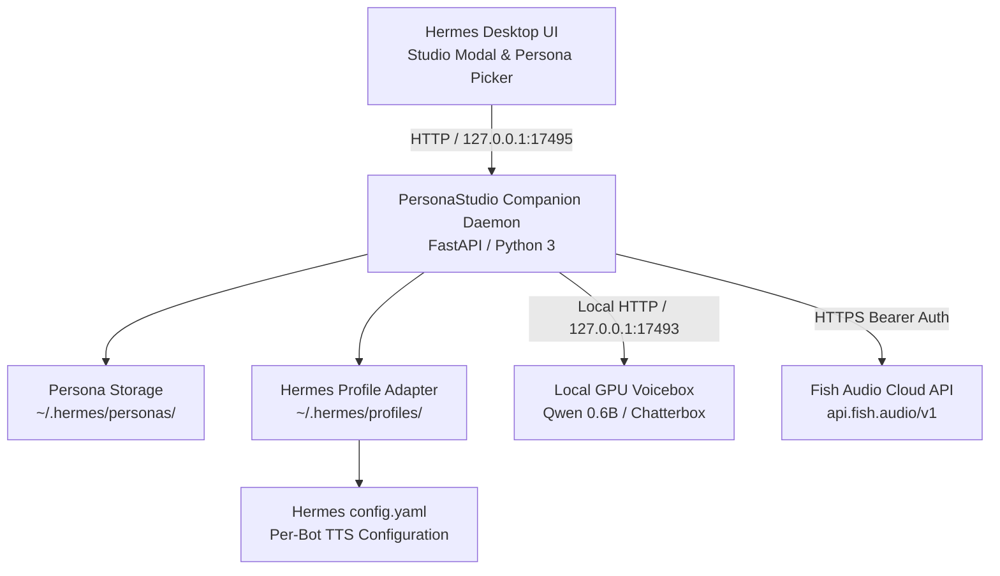

# Hermes Voice Persona Studio 🎙️⚡

[](https://opensource.org/licenses/MIT)
[](https://www.python.org/downloads/)
[](https://fastapi.tiangolo.com)
[](https://nousresearch.com)
[](https://developer.nvidia.com/cuda-zone)

**Speaking persona = display name + LLM system prompt + bound TTS voice.** Users switch that bundle from the Hermes Desktop titlebar and create it in Studio. Cloning a voice registers TTS *and* writes a matching persona bundle under `~/.hermes/personas/` — a Voicebox/Fish clone by itself is not enough.

The plugin stays outside `~/.hermes/hermes-agent` so Nous Hermes updates remain a clean checkout.

Powered seamlessly by **Fish Audio Cloud** and **Local GPU Neural TTS (Voicebox)**.

---

## 🌟 Key Features

### ⚡ Dual-Engine Synthesis (Cloud & Local GPU)
* **Cloud: Fish Audio**: High-fidelity hosted neural synthesis with custom zero-shot voice cloning, automated private model discovery (`self=true`), and cloud model management.
* **Local GPU: Neural Voicebox**: Zero-cloud, 100% private, offline TTS running on local NVIDIA GPUs. Features pre-configured models including **Qwen 3 (0.6B Fast)** delivering **~0.4s instant latency**, Chatterbox Turbo, and Kokoro.

### 🎙️ Zero-Shot Voice Cloning from UI
* Drag-and-drop or upload any 10–30 second reference sample (`.wav`, `.mp3`, `.m4a`).
* Register the cloned voice on local GPU Voicebox or Fish Audio **and** auto-create/update a speaking persona bundle (`prompt.md` + bound `voice_id`).
* Existing clones can be reconciled later with `python3 install.py --sync-voices` (idempotent).

### ⚙️ Provider Voice Model Management
* **Filter & Search**: Quickly search and clean up duplicate voice clones across providers.
* **Re-sample on Demand**: Refresh an existing voice profile with newer, clearer studio audio without breaking downstream bot associations.
* **1-Click Deletion**: Safely prune outdated or duplicate clones from both local storage and cloud APIs.

### 🤖 Assign voice to bot (TTS keys only)
* **Assign voice to bot** writes that Hermes profile’s TTS keys (Fish or Voicebox). It is not session **Apply to this chat**.
* Desktop group rooms do **not** yet play audio. There is no Read aloud / Speak replies control in the room UI. Assign does not make `@mention` or round-robin debate speak.

### 🛡️ 100% Non-Destructive
* Zero edits to the upstream Hermes agent repository (`~/.hermes/hermes-agent` stays a clean git checkout).
* Portable persona bundles saved safely in `~/.hermes/personas/` with isolated manifest and prompt markdown files.
* Built-in Electron single-instance lock recovery for Linux / Pop!_OS COSMIC environments.

---

## 🏗️ Architecture



---

## 🚀 Quick Installation

### Prerequisites
* **Hermes Desktop** installed on Linux, macOS, or Windows.
* Python 3.10+ with `pip`.
* Optional: Local NVIDIA GPU with CUDA for local neural Voicebox generation.

### One installer, Linux or Windows

`install.py` detects the OS. It supports **Windows** and **Linux**, and exits with a clear error on anything else. Prerequisite checks run before any deploy:

* Python 3.10+ and `fastapi`, `uvicorn`, `requests`, `pyyaml` (hard fail).
* Write access to the Hermes home (`%USERPROFILE%\.hermes` on Windows, `~/.hermes` on Linux) (hard fail).
* Optional Voicebox on `127.0.0.1:17493` and an optional Fish API key (warnings only).
* Companion port `17495` (free, already ours, or occupied by something else).

Preview the plan without copying files or starting processes:

```bash
python3 install.py --dry-run
```

#### Linux

```bash
git clone https://github.com/chuckatbcs/Hermes-Voice-Persona-Studio.git
cd Hermes-Voice-Persona-Studio
python3 install.py
```

`python3 install.py --systemd` also installs a `systemd --user` unit (`hermes-personastudio.service`) so the companion comes back after login. Without `--systemd`, the installer only starts a background process for this session.

#### Windows

From the repo checkout (PowerShell or Command Prompt):

```bat
py -3 install.py
```

This deploys the plugin to `%USERPROFILE%\.hermes\desktop-plugins\hermes-personastudio`, starts `server.py` from that installed directory, and registers a per-user Startup launcher:

* `%APPDATA%\Microsoft\Windows\Start Menu\Programs\Startup\Hermes_PersonaStudio_Companion.vbs`
* `%USERPROFILE%\.hermes\scripts\start_personastudio_companion.ps1`

The Startup script resolves the installed plugin under `%USERPROFILE%`. It does not hardcode a source-checkout path. `--systemd` is ignored on Windows with a warning.

Console status lines use ASCII tags (`[ok]`, `[warn]`, `[fail]`, `[info]`). The installer also asks the console for UTF-8 when the runtime allows it, so cp1252 windows do not crash on status output.

The installer will:
1. Run the prerequisite checks above.
2. Verify local Voicebox models (or default to Fish Audio cloud if GPU is absent).
3. Seed factory starter personas that already have a cloned `voice_id` (Cartman). Incomplete Fish-`default` presets (Jarvis / Storyteller) are **not** auto-created so deleted stub packs stay gone. Existing `prompt.md` files are never clobbered.
4. Reconcile existing Voicebox/Fish clones into persona bundles (`--no-sync-voices` to skip).
5. Deploy `plugin.js` to `~/.hermes/desktop-plugins/hermes-personastudio/` (never a misnamed `plugin.py`).
6. Launch the companion on `http://127.0.0.1:17495` and register OS persistence (Windows Startup folder, or Linux `--systemd`).

`python3 install.py --sync-voices` only runs the clone→persona reconciliation.

---

## 📖 User Guide

Peer-review notes for this release: [`docs/AGENT_REVIEW.md`](docs/AGENT_REVIEW.md).

### 1. Titlebar and Studio
1. Open **Hermes Desktop**.
2. In the chat header, use **`🎭 Personas`** or **`🎙️ Studio`**.
3. A **complete persona pack** overlays **speaking style + cloned TTS** on **this chat** (no new session). **Character strength (0–100%)**: **0%** = profile SOUL / AGENTS.md only; **100%** = character eclipses SOUL for this session; mid values blend. This is **not** TTS Temperature. The titlebar lists complete packs only; voice-only clones stay in Studio. Switching bots resets the titlebar to that profile’s stock unless **that** profile has its own overlay. **New Chat** returns to stock identity + **Edge / `en-US-AriaNeural`** (or stashed profile TTS).
4. **Studio (top → bottom):** **Target profile** → **Choose persona** (**Fish Audio (cloud)** vs **Voicebox (local GPU)** + voice labeled `· Fish` / `· Voicebox`) → **Character strength** → primary **Apply to this chat** → **Current applied state**. Selecting a pack hydrates the form. **Save pack** updates it (`PUT /personas/{id}`); **New** still POSTs. Preview voice / Reset to stock Hermes / clone stay secondary.

### 2. Preview a voice
1. Under **Choose persona**, pick **Fish Audio (cloud)** or **Voicebox (local GPU)**.
2. Choose a voice (`Name · Fish` or `Name · Voicebox`).
3. In **Voice preview & TTS**, enter **Preview text** and click **Preview voice**.
4. **Speed (TTS)** and **Temperature / Expressiveness (TTS only)** affect audition only. Character strength is how in-character the text replies are.

### 3. Assign voice to bot (TTS keys only)
1. Scroll to the quieter **Group-chat voice bind** section.
2. Select the Hermes bot / profile (e.g. mechanic, magellan, critic).
3. Click **Assign voice to bot**.
4. That writes the profile’s TTS keys. Desktop group rooms do **not** play audio today (no Read aloud / Speak replies). This is not **Apply to this chat**.

### 4. Clone a new voice
1. Under **Clone a new voice**, enter **New cloned voice name**.
2. Pick **Target engine / model**.
3. Choose a **Reference audio sample** (`.wav`, `.mp3`, `.m4a`).
4. Click **Upload & clone to Fish Audio** or **Upload & clone to Voicebox**.
5. Studio registers the clone **and** writes `~/.hermes/personas/<slug>/` (mannerisms, not a full “You are {name}…” identity). Use **Save pack** for a custom prompt; use **Apply to this chat** or the titlebar to overlay the current session.

### 5. Manage voices
1. Click **Manage voices** next to the voice selector.
2. Filter by name.
3. **Re-sample** uploads newer reference audio to that voice ID.
4. **Delete** removes the clone from the selected provider.

---

## 🔌 REST API Reference

The companion service runs at `http://127.0.0.1:17495`.

| Endpoint | Method | Description |
|---|---|---|
| `/api/studio/status` | `GET` | Health check and provider availability |
| `/api/studio/voices?provider={p}` | `GET` | List voices. Omit `provider` to return **Fish + Voicebox** |
| `/api/studio/resolve-tts` | `POST` | Prefer a Fish clone twin unless `explicit` selected Voicebox |
| `/api/studio/session/state` | `GET` | Session overlay stash status (`?profile_id=`) |
| `/api/studio/session/reset-all` | `POST` | Restore leftover overlays on plugin startup (no auto-apply) |
| `/api/studio/profiles/{id}/session/apply` | `POST` | Apply persona + voice + character strength for this chat; stash stock Hermes |
| `/api/studio/profiles/{id}/session/reset` | `POST` | Restore stashed stock Hermes personality + TTS |
| `/api/studio/models?provider={p}` | `GET` | List synthesis engines (Qwen, Chatterbox, etc.) |
| `/api/studio/audition` | `POST` | Generate real-time preview audio from text |
| `/api/studio/clone` | `POST` | Upload audio, register the cloned voice, **and** create/update the matching persona bundle |
| `/api/studio/sync-from-voices` | `POST` | Idempotent: create/update persona bundles for existing clones |
| `/api/studio/voices/{provider}/{id}` | `DELETE` | Delete a voice model from the provider |
| `/api/studio/voices/{provider}/{id}/resample` | `POST` | Update reference audio for existing voice |
| `/api/studio/profiles` | `GET` | List all Hermes bot profiles with active voices |
| `/api/studio/profiles/{id}/assign-voice` | `POST` | 1-click assign a voice to a bot profile |
| `/api/studio/personas` | `GET` / `POST` | List or create portable persona bundles (`?listable=true` = complete packs only) |
| `/api/studio/personas/{id}` | `PUT` | Update an existing pack (prompt, voice, **character_strength** 0–100) |

---

## 🧹 Uninstallation

Remove the desktop plugin and stop the companion. Hermes core and `~/.hermes/hermes-agent` stay untouched. Persona bundles and config keys are **kept**.

Linux (`python3`) and Windows (`py -3`):

```bash
python3 install.py --uninstall
```

On Linux this stops and removes the Studio-managed `systemd --user` unit, then frees port `17495`. On Windows it removes the Startup VBS and the Studio-managed files under `%USERPROFILE%\.hermes\scripts\` (only when they contain the Studio marker) and frees port `17495`.

Also delete `~/.hermes/personas/` and revert Studio-tracked personality/TTS keys (never deletes `config.yaml`):

```bash
python3 install.py --uninstall --purge
```

`--purge` is the same on both operating systems: it does not remove Hermes `config.yaml`, and it does not delete unrelated files in `.hermes\scripts`.

Agent-facing review notes for this release: [`docs/AGENT_REVIEW.md`](docs/AGENT_REVIEW.md).

---

## 📄 License

Distributed under the [MIT License](LICENSE).
